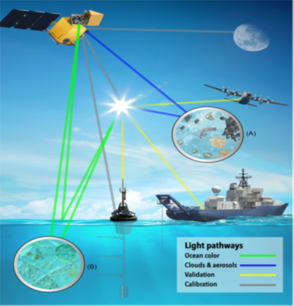

# Review of literature

## Particulate organic carbon (POC)

Marine organic carbon exists in 3 forms, which are dissolved, particulate and volatile.  Although particulate organic carbon (POC) in the seawater is only 1–10% of dissolved organic carbon , because of its importance in marine food chain and marine productivity, the study on POC has become a hot topic of marine sciences (Shen, Zhiliang; Yang, Heming & Liu, 2020). Particulate organic carbon in seawater includes two (life and non-life) components. Life component includes microbial bacteria, fungi, phage, microorganism photosynthetic plankton, zooplankton, small fish and shrimps and large marine mammals. Non-life part is also known as organic debris, including marine biological activity generated during the wreckage and debris(Zhu et al., 2011). Particulate organic carbon (POC) is an important form of oceanic carbon form, taking part in various biogeochemical processes and influencing both organic and inorganic carbon cycles (Bai et al., 2015; Liu et al., 2019b; Stramski et al., 1999b)

## Abundance of POC in ocean

One of the main sources of POC input to estuaries is by their associated rivers. Inputs from rivers will depend on a variety of factors involving both the river itself and the specific estuary (Bianchi and Bauer, 2012). On a global scale, rivers transport about 200 Tg C (Tg=1×1012 g) of terrigenous POC to marginal oceans annually (Wang et al., 2012). The distribution of dissolved, total particulate, and living particulate organic carbon in the surface (0-300 m) and deep ocean (>300m) are varied and summarized in Table 1 (Murray, 2000).

Table 2.1 Abundance of POC according to the depth

| Depth (m) | Dissolved (10^6 tonnes C) | Approximate concentration (µgC/L) | Particulate (10^6 tonnes C) | Approximate concentration (µgC/L) |
|-----------|---------------------------|------------------------------------|-----------------------------|--------------------------------------|
| 0-300a | 110000 | 1000-1500 | 11000 | 100 |
| 300-3800b | 630000 | 500-800 | 13000 | 3-10 |
| | 740000c | | 24000c | |
| Total | 670000d | | 14000d | |
| | 1000000e | | 30000e | |

a Concentrations vary widely with geographical area and with season. The depth at which the concentration tends to approach a constant level varies widely from 100 to 500 m.

b Concentrations more constant.

c (Williams, 1971)

d (Menzel, 1974)

e (Williams, 1975)

## Sources of POC

The photosynthetic fixation of inorganic carbon and nutrients into plant biomass is the ultimate source of POC to estuarine and coastal systems. However, these sources may be derived from a vast range of primary producers in aquatic and terrestrial environments (Bianchi, 2007). In addition to autochthonous estuarine sources, inputs of POC to estuaries can occur from a variety of marine, riverine, and terrigenous end members, which may support both estuarine autotrophic and heterotrophic production (Fig. 1).

### Terrestrially Derived POC

The tectonically driven uplift of marine sedimentary rocks above sea level on the Earth’s surface over geological time produces rock material that can be altered into soils and sediments by weathering processes. Chemical weathering processes in soils are important in the transformation of primary to secondary minerals. Particularly important for the formation of suspended POC in rivers and estuaries is the weathering of feldspars (the most abundant group of minerals in the Earth’s crust), K-feldspar is transformed to kaolinite (a clay) through the following reaction: 

\[ \text{KAlSi}_3\text{O}_8 + \text{H}_2\text{CO}_3 + \text{H}_2\text{O} \rightarrow \text{Al}_2\text{SiO}_5(\text{OH})_4 + 2\text{K}^+ + 4\text{H}_4\text{SiO}_4 + \text{HCO}_3^- \]

where:
- KAlSi₃O₈ is K-feldspar,
- H₂CO₃ is kaolinite.

During the formation of kaolinite, dissolved K+ ion is released from soils, while Al is retained in the solid-phase clay mineral product. Particle–particle and particle–dissolved constituent interactions in river and estuarine systems,  have broad-reaching effects on biogeochemical cycling of carbon and other biogenic elements in both dissolved and particulate phases in estuaries because of the strong linkages between the transformation and composition of clay minerals in drainage basin soils and estuarine sediments (Bianchi, 2007).

### Estuarine Algal Production

Phytoplankton and other primary producers (Fig. 1) represent a quantitatively significant source of POC to most estuaries. Seasonal changes in estuarine phytoplankton abundance and composition are controlled by changes in riverine inputs, nutrients, tidal variability, algal respiration, light availability, horizontal exchanges, and consumption by grazers (Battin et al., 2008; Boyer et al., 1993; Boynton et al., 1982; Cloern, 1996; Lucas and Cloern, 2002; Malone et al., 1988; O’Donohue and Dennison, 1997; Thompson, 1998). Benthic macroalgae and microphytobenthos are also important sources of POC in estuaries (De Jonge and Colijn, 1994; Gould and Gallagher, 1990; Pinckney and Zingmark, 1993; Rizzo et al., 1992; Sullivan and Moncreiff, 1990). However, there is increasing evidence that macroalgae and microphytobenthos may be at least as important as phytoplankton in shallow environments in terms of total biomass and POC production (Cahoon, 2002; Dalsgaard, 2003; Webster et al., 2002).

### Submerged and Emerged Aquatic Vegetation

Seagrass meadows may also be prominent producers of POC in many shallow littoral habitats in estuarine systems of the South Atlantic Bight (Den Hartog, 1970; Green et al., 2003; Hemminga and Duarte, 2000).The submerged canopy of estuarine seagrass systems has been found to decrease shallow-wave energy, thereby allowing for more efficient trapping of suspended particles and POC derived from both autochthonous and allochthonous sources (Fonseca and Kenworthy, 1987; Ward et al., 1984). Tidal freshwater marshes and mesohaline salt marshes, and mangrove systems have been found to be major sources of primary production and EAV POC in estuarine systems (Fonseca and Kenworthy, 1987; Ward et al., 1984).

The global export of POC from mangroves and salt marshes varies significantly between specific systems, but generally ranges between approximately 2–420 and 27–1052 gCM−2 yr−1, respectively (Alongi et al., 1989). 

## Environmental factors associated with POC

### Chlorophyll

Chlorophylls are ubiquitous pigments in the plant kingdom that play a key role in photosynthesis, a vital function for life on Earth (Roca et al., 2016). There are different classes of chlorophylls, major of them are chlorophyll-a (Chl-a) and chlorophyll-b (Chl_b). Chlorophyll-a (Chl-a) is a primary form of chlorophyll used in photosynthesis. It absorbs light energy from wavelengths of violet-blue and orange-red light, and it reflects green/yellow light, thus resulting in the observed green color of most plants. Because it is essential for photosynthesis in plants as well as plankton in the sea, detection of chlorophyll has become a well-established method used by various satellite systems (Fingas, 2018). The phytoplankton abundance played an important role in controlling the concentrations of POC. This was evident from the fairly good significant positive correlations of the concentrations of Chl-a with the concentrations of POC (Fernandes et al., 2009; Zhu et al., 2011).

### Sea surface temperature (SST)

Sea surface temperature (SST) is a strong indicator of productivity, pollution, and global climate change. It has been used to identify sources of pollution, thermal pollution, upwellings, and areas of variant productivity. It is also an indicator of stress to corals and other species (Fingas, 2018). On the landward side of the front, there was a sharp decline in SST as well as an abundance of phytoplankton biomass. On the seaward side of the front, they observed an increase in SST as well as a decrease in the amount of phytoplankton biomass (Kavak and Karadogan, 2011). As chl shows positive relation with POC concentration, POC shows inverse relation with SST. 

### Reproduction

Wild males produce spermatozoa from around 35 g BW and females becomes
gravid from 70 g. Mating occurs at night, shortly after moulting, while
the cuticle is still soft, and sperm are subsequently kept in a
spermatophore (sac) inserted inside the closed thelycum of the female.
Females of P. monodon are highly fecund, with gravid individuals
producing as many as 500 000 to 750 000 eggs. Spawning occurs at night
and fertilization is external, with females releasing sperm from the
thelycum as eggs are released in offshore waters. Nauplii hatch 12--15 h
after fertilization (FAO, 2018).

### Wind speed
The global ocean surface wind vector (wind speed and direction) field provides essential environmental information. It is critical data for short-term weather forecasts and warnings, nowcasting, climatology, and oceanography studies(Gaiser et al., 2004). Wind can enhance sediment resuspension and vertical mixing (He et al., 2013). In winter, strong wind strengthens tidal currents, leading to intensive sediment resuspension. POC concentrations were positively correlated with wind speed (Liu et al., 2019a). Water circulation on the inner shelf is primarily driven by wind. Easterly winds prevail during autumn, winter and spring, which drives westerly surface currents along the shelf, and thus, river plume is confined along shelf regions west of the outflows. In the summer, southerly winds reverse the local circulation and promotes an eastward transport of the river plume. A similar effect of wind and surface currents on POC patterns was also found to vary by season (Le et al., 2017).

### Water and sediment fluxes

Large riverine water flow strengthens water stratification and weakens vertical mixing (Shen et al., 2013). As a result, POC concentration becomes low in the wet season of the outer BoB. On the other hand, basin and riverbed erosion add POC (Xu and Milliman, 2009).

### Tidal processes

With high water velocity, bottom sediment was resuspended and dispersed to the water surface. As a result, surface POC concentrations were high with high water velocity. Surface POC concentration decreased during the late period of tidal ebbing and early period of tidal flooding with low water velocity; the same pattern was observed during the late period of tidal flooding and early period of tidal ebbing (Liu et al., 2019a).

Table 2.2 Other factors associated with POC

| Name of Factors       | Relationship with POC | References                  |
|------------------------|------------------------|---------------------------|
| Phytoplankton          | Positive               | (Stramska, 2014)          |
| Light                  | Positive               | (Fernandes et al., 2009)  |
| Nutrients              | Positive               | (Fan et al., 2018)        |
| Upwelling              | Positive               | (Stramska, 2014)          |
| Riverine Water flow    | Negative               | (Shen et al., 2013)       |
| Riverbed erosion       | Positive               | (Xu and Milliman, 2009)  |
| Current                | Positive               | (Fan et al., 2018)        |
| El Nino                | Negative               | (Stramska, 2009)          |

## Trends of POC

The spatial and temporal variations of POC in the Yellow-Bohai Sea over 2002–2016 were studied (Fan et al., 2018). A research has been done on satellite observations of seasonal and regional variability of POC concentration in the Barents Sea (Stramska and Bialogrodzka, 2016). Comparison of in situ and satellite ocean color determinations of POC concentration in the global ocean have been done (Świrgoń and Stramska, 2015). Another research for observing POC in global ocean have also been done from SeaWiFS ocean color (Stramska 2009).

Seasonal and inter annual variability of particulate organic carbon within the Southern Ocean from satellite ocean color observations have been studied (Allison et al., 2010). Distribution and source analyses of POC in the Yellow and Bohai Sea during summer, 2013 have also been observed (Haibo et al., 2016). A study has been done on spatial and temporal variations of POC sinking flux in global ocean from 2003 to 2018 (Xie et al., 2019). A study has been done for validation and inter comparison of ocean color algorithms for estimating POC in the oceans (Evers-King et al., 2017). A research have been done for finding distribution and sources of POC in the Yellow Sea and East China Sea (Cheng et al., 2011). A different kind of research on POC have been done for investigating remotely sensed detection and application analysis of ocean POC (Cong et al., 2012). Research based on POC have also been done in river and estuary. For example  researches have been done for satellite observation of POC dynamics in two river-dominated estuaries (Le et al., 2017) and RS observation of POC in the Pearl River Estuary (Liu et al., 2015) and temporal variability in terrestrially-derived sources of POC in the lower Mississippi River and its upper tributaries have also been studied (Bianchi et al., 2007).

Spatial and temporal distribution of particulate organic carbon in Yellow Sea and East China Sea have been studied (Shi et al., 2011). Variability of particulate organic carbon in inland waters have been observed from MODIS Aqua imagery (Duan et al., 2014). A color-index based empirical algorithm for determining POC concentration have been done in the ocean from satellite observations (Le et al., 2018). Satellite-derived POC flux in the Changjiang River through different stages of the Three Gorges Dam have been observed (Liu et al., 2019a). POC and Its composition in Jiaozhou Bay have been obsereved in 2019 (Shen, Zhiliang; Yang, Heming & Liu, 2020). Seasonal and spatial distribution of particulate organic matter in the Bay of Bengal was observed (Fernandes et al., 2009).

Few studies related to POC have been found in recent years in BoB but most of the studies focused on the southern (Indian) part of BoB. Therefore, there is a sever scarcity of POC information in the Northen (Bangladesh) part of BoB using satellite data.

##	Effect on Marine Life 

*Ocean carbon cycle*: Particulate organic carbon (POC) is an important form of oceanic carbon form, taking part in various biogeochemical processes and influencing both organic and inorganic carbon cycles It can sequester carbon, scavenge associated elements and compounds, and sink to the deep ocean as part of the “biological pump”. Land and ocean ecosystems, which are the two largest active carbon reservoirs in the world, are connected by rivers (Bai et al., 2014; Wang et al., 2012).

POC in the ocean is also added through local phytoplankton production, flocculation of dissolved organic carbon (DOC), and sediment resuspension, etc. Oceanic POC can also be removed through trans formation of POC to DOC, microbial respiration, and particle deposition, etc. Due to these physical and biogeochemical properties, investigating the variations in marine POC using in-situ data from ships or other platforms remains challenging (Liu et al., 2019a).

Under the influence of the East Asian monsoon, Asian river watersheds are characterized by high POC yields (Ludwig et al., 1996). POC concentration in summer is usually higher than that in winter.

##	Estimation of POC

POC is measured from both in situ (ship base) and satellite data. In ship base-based management, There are many analytical methods for the measurement of POC distribution (Biddanda and Benner, 1997; Knap et al., 1996; Parsons et al., 1984; Sharp, 1974). Among the most used method for the POC estimation is the spectrophotometric method and this is done for the validation of remote sensing data (Parsons et al., 1984). Water samples will be collected from different location of Bay of Bengal with the help of Bangladesh Navy.  Then it will be immediately filtered through pre-combusted (1000C 1h) 47mm NCF/C (0.45µm pore size) nitrocellulose filter. Filters will be stored at -200C until the analysis will be completed. Particulate matter left on the filters will be analyzed for POC. As the filters will not be pre-weighed, suspended matter could not be determined on these samples. POC will be analyzed spectrophotometrically after wet oxidation of carbon by acid dichromate (Parsons et al., 1984).

POC is composed to suspended particles whose light absorption and back scattering features can be recorded by satellite sensors. (Liu et al., 2019b). The use of satellite-based sensors to estimate POC in the estuary, lakes and global ocean  provides numerous advantages with respect to standard field measurement(Le et al., 2017; Liu et al., 2015; Stramski et al., 1999a). The efficiency of satellite measurement depends on the optical characteristics of the water body. There are several satellite systems in operation today that collect imagery that is subsequently distribute POC data to users such as MODIS Aqua (Moderate Resolution Imaging Spectroradiometer) (Duan et al., 2014), SeaWiFS (Stramska, 2009), The Visible and Infrared Imager/Radiometer Suite including the Suomi National Polar-orbiting Partnership (VIIRS-SNPP) (Lee et al., 2019). MODIS (or Moderate Resolution Imaging Spectroradiometer) Aqua data is frequently used to estimate the distribution of POC in different parts of world ocean (Evers-King et al., 2017; Gardner et al., 2006; Le et al., 2018; Liu et al., 2019a, 2019b; Zibordi and Mélin, 2017).

## MODIS Aqua Satellite

The Moderate Resolution Imaging Spectroradiometer (MODIS), is a 36-band spectroradiometer measuring visible and infrared radiation and obtaining data that are being used to derive products ranging from vegetation, land surface cover, and ocean chlorophyll fluorescence to cloud and aerosol properties, fire occurrence, snow cover on the land, and sea ice cover on the oceans. The first MODIS instrument was launched on board the Terra satellite in December 1999, and the second was launched on Aqua in May 2002.

Instrument Characteristics

- Selected for flight on Terra (launched Dec. 1999) and Aqua.
- Medium-resolution, multi-spectral, cross-track scanning radiometer.
- Measures physical properties of the atmosphere, and biological and physical properties of the oceans and land.
- 36 spectral bands—21 within 0.4-3.0 µm; 15 within 3-14.5 µm.
- Continuous global coverage every 1 to 2 days.
- Signal-to-noise ratios from 900 to 1300 for 1 km ocean color bands at 70° solar zenith angle.
- NEDT's typically < 0.05 K at 300K.
- Absolute irradiance accuracy of 5% for <3 µm and 1% for >3 µm.
- Daylight reflection and day/night emission spectral imaging.

Table 2.3 Instrument Facts of MODIS

| Characteristic                     | Details                                              |
|-------------------------------------|------------------------------------------------------|
| Responsible Center                 | NASA Goddard Space Flight Center                      |
| Heritage                            | Advanced Very High-Resolution Radiometer (AVHRR), High-Resolution Infrared Radiation Sounder (HIRS), Landsat Thematic Mapper (TM), Nimbus-7 Coastal Zone Color Scanner (CZCS) |
| Polarization Sensitivity            | 2% from 0.43 µm to 2.2 µm and ±45° scan               |
| Swath                               | 2300 km at 110° (±55°) from 705 km altitude           |
| Mass                                | 229 kg                                               |
| Duty Cycle                          | 100%                                                 |
| Data Rate                           | 6.2 Mbps (average), 10.5 Mbps (day), 3.2 Mbps (night) |
| Thermal Control By                  | Radiator                                             |
| Thermal Operating Range             | 268°K ±5°K                                           |
| Field of View (FOV)                 | ±49.5°                                               |
| Instrument Instantaneous FOV       | 250 m (2 bands), 500 m (5 bands), 1000 m (29 bands)  |
| Geolocation (100m, 2σ)              | Control: 3600 arcsec                                 |
|                                     | Knowledge: 141 arcsec                                |
|                                     | Stability: 28 arcsec/sec                             |
|                                     | Jitter: 1031 arcsec/sec (yaw and roll), 47 arcsec/sec (pitch) |
| Physical Size                       | 1.44 x 1.184 x 1.638 m                                |

## WindSat 

WindSat is the primary payload of the Coriolis satellite which was launched on 6 January 2003. WindSat, the first space-borne multifrequency polarimetric microwave radiometer, has been developed by the US Naval Research Laboratory (NRL) to demonstrate that ocean surface wind vectors can be derived from space using a passive instrument. The resolution of the winds is defined by the lowest frequency channel. Although not a scatterometer, it is useful for monitoring purposes to treat it as such due to the ambiguity present in the wind vectors. 

The WindSat radiometer is well-calibrated and contains the lower frequency channels required for SST retrievals. The radiometer operates in 5 discrete channels: 6.8, 10.7, 18.7, 23.8 and 37.0 GHz.  All are fully polarimetric except the 6.8 and 23.8 GHz channels that have only dual polarization. Table 4 summarizes the channel details.  The feedhorns of each frequency channel trace out different arcs along the scan, therefore the Earth Incidence Angles (EIA) are different for each frequency band. Unlike previous radiometers, the WindSat sensor takes observations during both the forward and aft looking scans. This makes the WindSat geometry of the earth view swath quite different and significantly more complicated to work with than the other passive microwave sensors. The RSS WindSat products are the only dataset available that uses both the fore and aft look directions.  By using both directions, we obtain a wider swath and more complicated swath geometry as is visible in the browse images (Gaiser et al., 2004).

Table 2.4 Summary of WindSat channels, polarizations Earth incidence angles and channel resolutions.  Polarizations are listed as V for Vertical, H for Horizontal, P for +45 deg, L for Left Circular, and R for Right Circular (Wentz, F.J., L.Ricciardulli, C.Gentemann, T. Meissner, K.A. Hilburn, 2013) 

| Band [GHz] | Polarizations      | Average EIA [deg] | Spatial Resolution (3-dB footprint size) [km x km] |
|------------|---------------------|---------------------|------------------------------------------------------|
| 6.8        | V, H                | 53.8                | 39 x 71                                              |
| 10.7       | V, H, P, M, L, R     | 50.1                | 25 x 38                                              |
| 18.7       | V, H, P, M, L, R     | 55.6                | 16 x 27                                              |
| 23.8       | V, H                | 53.2                | 20 x 30                                              |
| 37.0       | V, H, P, M, L, R     | 53.2                | 8 x 13                                               |

## Bay of Bengal (BoB)

Bay of Bengal a northern extended arm of the Indian ocean, is located between latitudes 20°N and 23°N and longitudes 88°E and 93°E. It is bounded in the west by the east coasts of Sri Lanka and India, on the north by the deltaic region of the Ganges-Brahmaputra-Meghna river system, and on the east by the Myanmar peninsula extended up to the Andaman-Nicobar ridges (Banglapedia, 2014). The recent two verdicts of maritime boundary of Bangladesh with Myanmar and India, allowed the country to exercise sovereign right to 118,813 sq. km of waters extending up to 12 nautical miles of territorial sea and a further Exclusive Economic Zone (EEZ) of 200 nautical miles into the sea and continental shelf extending up to 354 nm from the Chittagong coast (Hussain et al., 2017). This award allowed Bangladesh to establish sovereign rights over the living and non-living resources of BoB territorial waters. Fig. 1 shows the present maritime boundary of Bangladesh. 

The BoB is featured with a humid monsoon climate with moderate rainfall 1638-3558 mm and air temperatures 19-33° C prevail in the coastal belt. SST varies from 22.8-32.9° C in the BoB. The surface salinity varies from 10-29 ppt and increases rapidly within the upper depth of 20-30 m. The primary productivity of BoB is very rich during the northeast monsoon (NEM), 0.15-1.45cm2 day-1.

## Seasons of Bangladesh

Bangladesh has a subtropical seasonal monsoon, characterized by wide seasonal variations in rainfall, moderately warm temperatures, and high humidity. Based on monsoon, four seasons are recognized such as pre-monsoon (March, April, and May), southwest monsoon (June to September), post-monsoon (October and November) and northeast monsoon or winter (December, January, and February). Southwest monsoon is the most important feature of controlling the climate of Bangladesh. More than 71% of the annual rainfall is received during this season. Variability in the onset, withdrawal of monsoon and rainfall during the monsoon season has profound impacts on fisheries, water resources, power, agriculture, and ecosystems, in Bangladesh. On the other hand, in the winter season, the temperature falls and causing a decrease in SST. The brief characteristics of four seasons are given below:

**Winter or Northeast Monsoon (December - February)**

This season is characterized by very light northerly winds, mild temperature, dry weather, and lower SST. It is also known as the winter season. The mean temperature is in the range of 18- 22° C and SST 24-26.7° C. Only 2% of the annual total rainfall occurs in this season (Khatun et al. 2016). During winter season, the northeasterly winds prevail over the country blowing from land to sea except northern hilly areas where mainly easterly wind prevails. But during the passage of upper air cyclonic circulation over northwestern part of the country (called western disturbances) light rain occurs over the country (Khatun et al., 2016).

**Summer or Pre-Monsoon (March-May)** 

The mean temperature of Bangladesh during the summer months varies between 23-30 °C and SST 26.50-30.80 °C. April and May are the hottest months of a year. The highest maximum temperature ranging from 36-40oC is attained in the northwestern and southwestern districts. Low-pressure results in the formation of thunder cloud and the development of severe thunderstorms. Only 19 % of the total annual rainfall occurs in this season. This season is also characterized by cyclogenesis in the BoB. Some of the low pressure formed over the BoB intensified into a depression and turned into a cyclonic storm. They are occasionally associated with storm surges and causes of high causalities and damages. Thunderstorms are very common during this season over the country. In this season, localized thunderstorms associated with violent winds, torrential downpours and occasionally hail occur. These are locally known as the ‘Kalbaishakhi’ are the common weather phenomena (Khatun et al., 2016). 

**Southwest Monsoon (June - September)**

In this season, the surface wind changes to southwesterly/southerly direction. Wind speed remains light to moderate. The onset and withdrawal of monsoon vary from year to year and place to place. SST is ranged from 28 to 30.50° C. In general, rain with widespread cloud coverage and high humidity are the characteristics of this season. More than 71 % of the total annual rainfall occurs in this season. Monsoon depression forms over the BoB during this season. They generally move northwestwards and cross the Indian coast. Some of them move towards Bangladesh coasts and caused heavy rainfall. Depressions seldom attain into cyclone state in this season (Khatun et al., 2016). 

**Post-Monsoon (October - November)**

This is the transitional season from summer monsoon to the winter. Rainfall decreases considerably during October and November. Only 8% of the annual total rainfall occurs in this season (Khatun et al., 2016). Temperature falls noticeably. SST is ranged from 27.50 to 30.50°C. Cyclonic disturbances from over the BoB during this season (Khatun et al., 2016).

## Satellite Imagery

POC in coastal margin environments typically occurs in complex systems where most features vary dramatically in time and space. Over short timescales (e.g., hours to days), this variability limits the utility of shipboard in situ measurements for mapping the spatial concentration and flux of materials in coastal margins. Although data obtained from satellites can provide some of the routine, synoptic information required to study these complex environments, commensurate shipboard measurements are frequently needed to translate remote-sensing imagery to meaningful biogeochemical parameters and to facilitate process-based studies. In addition, remote sensing affords the ability to extend potentially locally derived information to regional and global scales (Bianchi and Bauer, 2012). 

Ocean color is the primal facet in ocean monitoring as it is the basis for several other forms of detection. Ocean color is strongly influenced by adsorption and reflection or scattering of light at the water’s surface. Light in the red wavelengths is strongly absorbed by uncontaminated water, making the oceans appear blue. Some of this blue light is reflected and can be used by remote sensors to categorize targets. Particles or objects will scatter the light enabling these to be detected. This is the basis of much of the work that has been using ocean color. Further, any applications of the use of color must be subject to certain criteria to enable its use for certain facets of environmental studies, and several researchers have studied the oceans and mapped out areas where sensor calibrations can suitably be conducted (Fingas, 2018) .

## Remote Sensing

Remote sensing (RS) is an art or science of telling something about an object without touching it. Remote sensing of the marine environment began in the mid-20th century with the use of cameras and acoustic sensors to characterize the target. This has grown to satellites dedicated to the task of delineating various aspects of the marine environment. RS collect data by detecting the energy level that is reflected from Earth. Radiation that is emitted or reflected by the object or water body, is recorded by sensors. These sensors can be on satellites or mounted on aircraft (NOAA 2017). Light from the sun reflects on the water body and directed satellite sensors (passive RS). At that time, the possible interactions are absorption and scattering by the water constituents; reflection, and absorption by the sea surface; reflection and refraction at the water/air interface; and absorption and scattering the atmosphere (Fig. 3). The success of the applications of RS is improved considerably by taking a multiple view approach to data collection i.e. data can be taken either by multistage sensing (data about a site are collected from multiple altitudes) or multispectral sensing (data are acquired simultaneously in several spectral bands) or multi- temporal sensing (data are collected on more than one occasion). 

