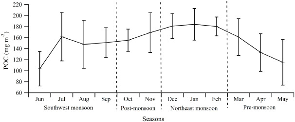
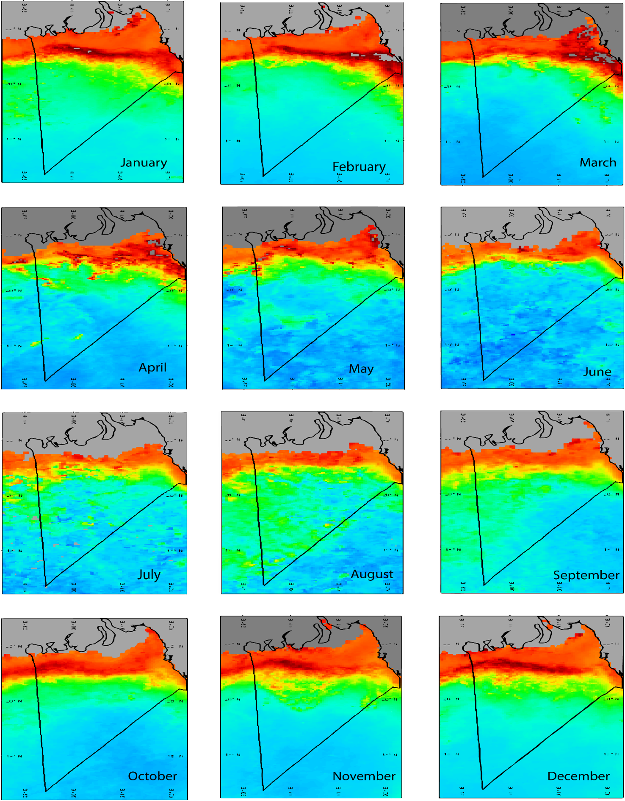
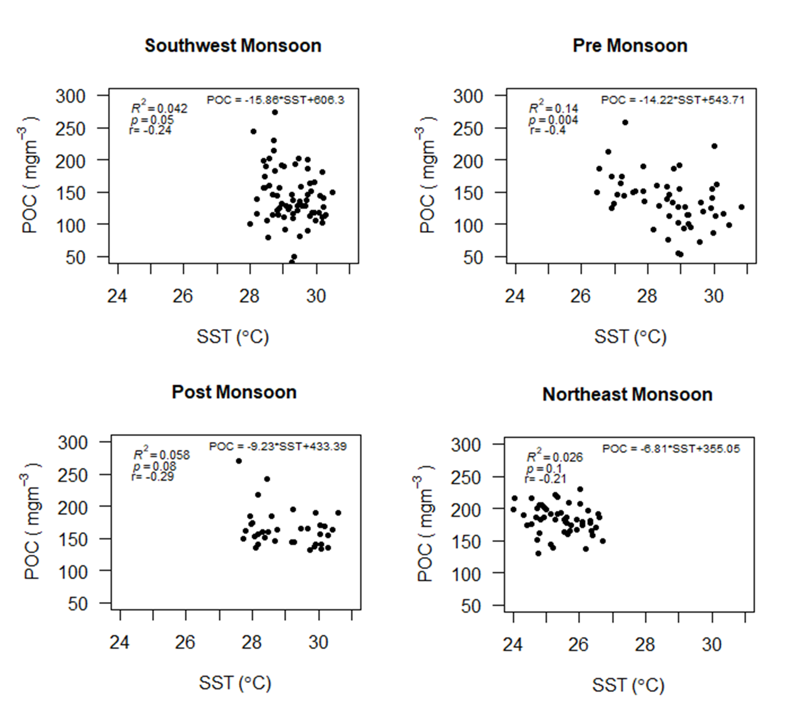
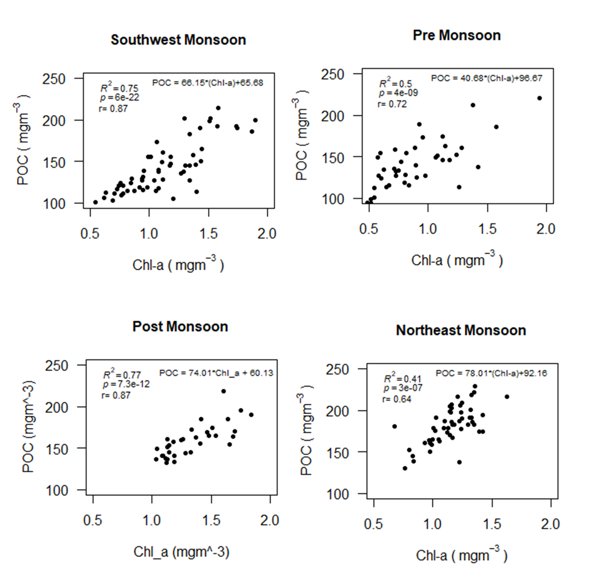
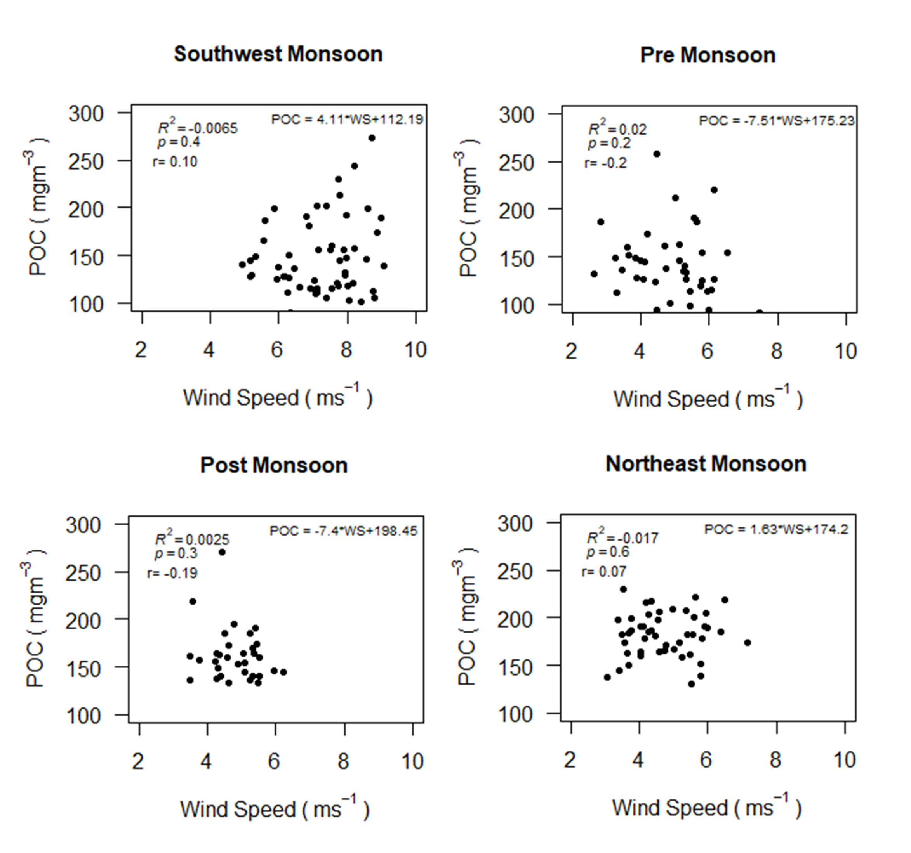
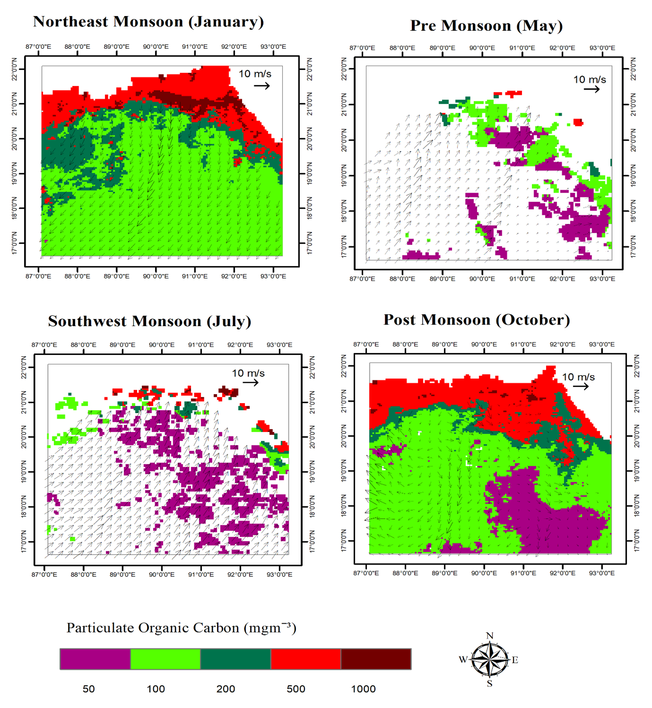
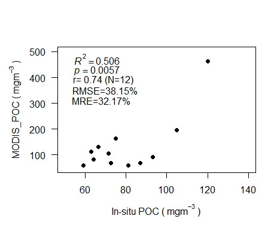
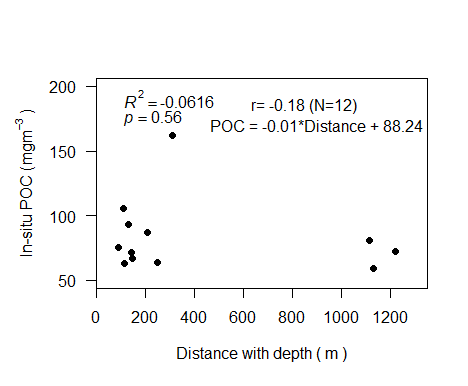

# Results

## Seasonal trend of particulate organic carbon (POC) concentration in BoB

BoB has a unique character called monsoon that demarcates the season and influences the major phenomena of the sea part as well as the territorial part of Bangladesh. Therefore, monsoon has a major influence on POC variability over the BoB. So, understanding the seasonal POC variability helps us to reveal the effects of monsoon on POC variability. The seasonal pattern of POC in the BoB is illustrated by climatological monthly composites of the MODIS-aqua images from July 2002 to June 2019 (Fig. 4.2). In this Figure, a month represents the average value of the same month for all the years from 2002 to 2019. Monthly averaged POC was ranged between 103.08 and 184.22 mgm-3. Northeast-monsoon (December-February) showed the highest (181.80 ±22.34 mgm-³) POC. From that, a small reduced concentration was observed during two monsoon seasons, i.e., post-monsoon (October-November) (162.33±28.16 mgm-³) and Southwest Monsoon (June- September) (141.31 ±36.40 mgm-³). Lowest POC (136.56±36.24 mgm-³) was found during pre-monsoon (March-May) particularly in the month of May (115.38±41.31 mgm-³) (Fig. 4.1).

 
POC was found significantly different (F (3,202) = 18.09, p = .000) among the seasons according to the analysis of one-way ANOVA (Table 6). The post hoc analysis (LSD) also showed significant difference among the seasons except the mean difference between the southwest and pre monsoon (p = .433) (Table 7).

Table 6 Statistical test for variability of mean POC among the seasons.

| Source           | Sum of Squares | df | Mean Square | F      | Sig.  |
|------------------|----------------|----|-------------|--------|-------|
| Between Groups   | 69937.270      | 3  | 23312.423   | 18.092 | 0.000 |
| Within Groups    | 260285.894     | 202| 1288.544    |        |       |
| Total            | 330223.164     | 205|             |        |       |

Table 7 Statistical test for multiple comparisons of POC based on season.

| (I) Seasons          | (J) Seasons         | Mean Difference (I-J) | Std. Error | Sig.  | 95% Confidence Interval |
|----------------------|---------------------|-----------------------|------------|-------|--------------------------|
|                      |                     |                       |            |       | Lower Bound              | Upper Bound              |
| Northeast monsoon    | Southwest Monsoon   | 40.12230*             | 6.64942    | .000  | 27.0111                  | 53.2335                  |
|                      | Pre-Monsoon         | 45.34670*             | 7.10853    | .000  | 31.3303                  | 59.3631                  |
|                      | Post Monsoon        | 16.57801*             | 7.81399    | .035  | 1.1706                   | 31.9855                  |
| Southwest Monsoon    | Northeast monsoon   | -40.12230*            | 6.64942    | .000  | -53.2335                 | -27.0111                 |
|                      | Pre-Monsoon         | 5.22440               | 6.64942    | .433  | -7.8868                  | 18.3356                  |
|                      | Post Monsoon        | -23.54429*            | 7.39879    | .002  | -38.1331                 | -8.9555                  |
| Pre-Monsoon          | Northeast monsoon   | -45.34670*            | 7.10853    | .000  | -59.3631                 | -31.3303                 |
|                      | Southwest Monsoon   | -5.22440              | 6.64942    | .433  | -18.3356                 | 7.8868                   |
|                      | Post Monsoon        | -28.76869*            | 7.81399    | .000  | -44.1761                 | -13.3612                 |
| Post Monsoon         | Northeast monsoon   | -16.57801*            | 7.81399    | .035  | -31.9855                 | -1.1706                  |
|                      | Southwest Monsoon   | 23.54429*             | 7.39879    | .002  | 8.9555                   | 38.1331                  |
|                      | Pre-Monsoon         | 28.76869*             | 7.81399    | .000  | 13.3612                  | 44.1761                  |

*. The mean difference is significant at the 0.05 level.

Figure 4.2 : MODIS derived monthly climatology of POC from July 2002 to June 2019 in the BoB

## Seasonal relation between SST and POC

SST was ranged from 24.02 0 C to 30.83 0 C (2002-2019) among the seasons in the study area. An inverse relation was found between SST and POC for all the seasons in the BoB. The regression coefficient (b) between SST and POC was high (-15.86) in Southwest Monsoon (June- September) and low (-6.81) in northeast-monsoon (December-February) (Fig. 8). Statistically significant relation between SST and POC was found in southwest monsoon and pre-monsoon (p<0.05) whereas no significant (p >0.05) relation was found in northeast monsoon and post-monsoon. The correlation coefficient (r) was ranged from -0.21 to -0.40 (Fig. 4.3).

## Seasonal relation between Chl-a and POC

Chl-a was ranged from 0.19 to 1.94 mgm-3 among all the seasons (2002-2019). A strong positive relation was found between Chl-a and POC for all the seasons in the BoB. The regression coefficient (b) between Chl-a and POC was highest (78.01) in northeast-monsoon (December-February) and lowest (40.68) in pre-monsoon (March-May) (Fig. 4.4). Statistically significant (p<0.05) relation between the Chl-a and POC was found in all the seasons. The correlation coefficient (r) was ranged from 0.64 to 0.87 (Fig. 4.4).

## Seasonal realtion between  POC and wind vector 

a very weak positive relation was found between wind speed and POC for the Southwest Monsoon (June- September) and northeast monsoon (December-February) and a weak negative relation was found in pre and post monsoon in the BoB. The regression coefficient (b) between wind speed and POC were 4.11, 1.63, -7.51 and -7.4 in southwest monsoon (July-September), Northeast monsoon (December-February), pre and post monsoon respectively (Fig. 4.5). Statistically significant relation was not found between the wind speed and POC (p>0.05) in the study area. 

 
Monthly wind speed range was 3.8-9.0 ms-1 in January representing northeast monsoon, 5.0-10.6 ms-1 in May,7.6-13.4 ms-1 in July and 3.6-10.0 ms-1 in October representing pre-monsoon, southwest monsoon and post monsoon respectively.  POC was very high with the wind vectors prevailing northeasterly wind in northeast monsoon (January 2019) and post monsoon (October 2019) compared to other seasons. In southwest monsoon (July 2019) and pre-monsoon (May 2019), prevailing southwesterly winds in may have contributed to low POC in the inner, middle and outer shelves. The circulation winds October of post monsoon may have contributed to high POC in the inner shelves of the BoB (Fig. 4.6).  

## In-situ validation

In-situ POC measurement ranged from 62.92 to 162.14 mgm-3 and are shown in Table 8. The correlation coefficient (Fig. 4.7) between the in-situ value and MODIS-Aqua satellite-derived POC was 0.74 with a root mean square error (RMSE) of 38.15% and mean relative error (MRE) of 32.17 % (Fig. 4.7). The coefficient was found highly significant (p<0.05) in the study area. 

## Relation with distance 
A negative relation (-0.18) between the in-situ POC and distance with depth was found in the study area (Fig. 4.8). Statistically significant relation was not found between distance with depth and in-situ POC. POC was found decreasing from the shelf zone to the deep ocean.

